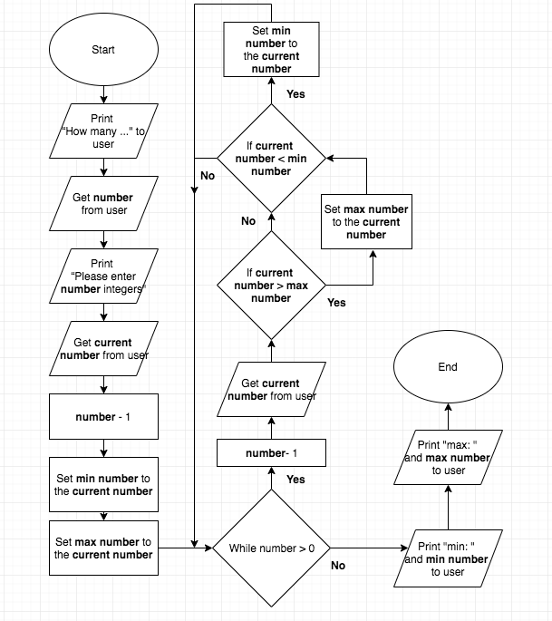

# Introduciton to C++


***
# Problem Solving

1. Make sure you have a clear understanding of all the requirements.  In the real world, this is sometimes the most challenging part.

2. Plan tests you can use to check potential solutions for correctness.

3. Design your approach.  One of the most commonly used methods for this is stepwise refinement.  This is a process of breaking up the original problem into some number of smaller sub-problems.  Next, you take each sub-problem and break it up into even smaller sub-problems.  This is repeated until you get sub-problems that are small enough to be translated into code.

4. Translate your design into computer code (checking it with the tests from #2).

5. Reflect on how you arrived at your solution.  What worked and what didn't?  How can this experience help you solve future problems?

***
# Assignmnet 2a
Wei-Chien Hsu 
CS-165: ACCELERATED TO COMP SCI
Assignment 2a project plan

## Testing Plan


## Stepwise Refinement
1.	Asks the user how many integers they would like to enter
•	Print out “How many integers would you like to enter?” for user in console.
•	There is a variable numberOfInt to record user’s input.
•	User could input an integer (assume they will enter a number >= 1)
•	numberOfInt equals to user’s input

2.	Prompt the user to enter that many integers
•	Base on the numberOfInt to print out “Please enter ___ integers.” in console.

3.	User could Input number
•	Base on the numberOfInt to ask that many times for user inputs their number.
•	We should track the current largest and smallest numbers by upgrading both variables maxInt and minInt.
- i.	Save the user input in a variable currentInt.
- ii.	We should initialize maxInt and minInt by the first input.
- iii.	After the first input, we should compare each new currentInt with the maxInt and minInt.
- iv.	If currentInt is greater than maxInt, upgrade the value for maxInt as currentInt.
- v.	If currentInt is smaller than minInt, upgrade the value for minInt as currentInt.
- vi.	Since we need to limit the times user input, it needs to let numberOfInt minus one each time when user enter the value.
- vii.	While numberOfInt is not larger than 0, stop asking user to enter a new Integer.

4.	Display the largest and smallest of those numbers 
•	Print out “min: “ with minInt for user in console.
•	Print out “max: ” with maxInt for user in console.
•	End the program return 0.

## Pseudocode
```
Print out “How many integers would you like to enter?” to user.
Get the number of Integer that user would like to enter (Below as number) from user.
Print out “Please enter (number) integers.” to user.
Get the first current number from user
Minus 1 to the number
Set the min number to the current number
Set the max number to the current number
While number > 0
	Minus 1 to the number
	Get the current number from user
	If current number > max number
		Set max number to the current number
	If current number < min number
		Set min number the to the current number
Print out “min:  “ and min number to user
Print out “max:  “ and max number to user
```
- 可以改進的地方: 使用一樣的number or integer, 固定在User Input之後再減1

## Flowchart 


***

## Double vs Float

double精度高，有效数字15-16位，float精度低，有效数字6-7位，但是double消耗的内存是float的两倍，运算速度比float慢得多，建议能用float保证精度的就用float，少用double。

- 有些编译器 float的有效数字位是 8位 , 有些有效数字位是 7位
- 有些编译器double的有效数字位是 15位, 有些是 16位

无论是float还是double，在内存中的存储主要分成三部分，分别是：

1. 符号位（Sign）: 0代表正数，1代表负数
2. 指数位（Exponent）: 用于存储科学计数法中的指数部分，并且采用移位存储方式
3. 尾数位（Mantissa）: 用于存储尾数部分

## Data Type Ranking (Concersion)

```
long double
double
float
unsigned long long int
long long int
unsigned long int
long int
unsigned int
int
```

- Rule1: char, short, and unsigned short values are automatically promoted to int values.
- Rule2: When an operator works with two values of different types, the lower-ranking value is promoted to the type of the higher-ranking value. (int * double -> double)
- Rule3: When the final value of an expression is assigned to a variable, it will be converted to the data typeif that variables.

## Type Casting
```c
static_cast<DataType>()
```


***

## Random Number - rand() / srand()

我们知道rand()函数可以用来产生随机数，但是这不是真正意义上的随机数，是一个伪随机数，是根据一个数（我们可以称它为种子）为基准以某个递推公式推算出来的一系列数，当这系列数很大的时候，就符合正态公布，从而相当于产生了随机数，但这不是真正的随机数，当计算机正常开机后，这个种子的值是定了的，除非你破坏了系统。

### rand()
- 功能:随机数发生器
- 用法:int rand(void)
- 所在头文件: stdlib.h
- rand()的内部实现是用线性同余法做的，它不是真的随机数，因其周期特别长，故在一定的范围里可看成是随机的。
- rand()返回一随机数值的范围在0至RAND_MAX 间。RAND_MAX的范围最少是在32767之间(int)。用unsigned int 双字节是65535，四字节是4294967295的整数范围。0~RAND_MAX每个数字被选中的机率是相同的。
- 用户未设定随机数种子时，系统默认的随机数种子为1。
- rand()产生的是伪随机数字，每次执行时是相同的;若要不同,用函数srand()初始化它。

```c
int main() {
  int num;
  for(int i = 0; i < 5; i++) {
    num = rand();
    cout << num << endl;
  }
  return 0;
}
```

- The Same outputs:
```
16807
282475249
1622650073
984943658
1144108930
```

### 2.srand()
- 功能:初始化随机数发生器
- 用法: void srand(unsigned int seed)
- 所在头文件: stdlib.h
- srand()用来设置rand()产生随机数时的随机数种子。参数seed必须是个整数，如果每次seed都设相同值，rand()所产生的随机数值每次就会一样。

### 3.使用当前时钟作为随机数种子
rand()产生的随机数在每次运行的时候都是与上一次相同的。若要不同,用函数srand()初始化它。可以利用srand((unsigned int)(time(NULL))的方法，产生不同的随机数种子，因为每一次运行程序的时间是不同的。
 
### 4.产生随机数的用法
1) 给srand()提供一个种子，它是一个unsigned int类型；
2) 调用rand()，它会根据提供给srand()的种子值返回一个随机数(在0到RAND_MAX之间)；
3) 根据需要多次调用rand()，从而不间断地得到新的随机数；
4) 无论什么时候，都可以给srand()提供一个新的种子，从而进一步“随机化”rand()的输出结果。

0~RAND_MAX之间的随机数程序：
```c
#include <iostream>
#include <stdlib.h>
#include <time.h> 
using namespace std; 

int main()
{ 
        srand((unsigned)time(NULL)); 
        for(int i = 0; i < 10;i++ ) 
                cout << rand() << '/t'; 
        cout << endl; 
        return 0;
}
```

### 5.产生一定范围随机数的通用表示公式

- 要取得[a,b)的随机整数，使用(rand() % (b-a))+ a;

- 要取得[a,b]的随机整数，使用(rand() % (b-a+1))+ a;

- 要取得(a,b]的随机整数，使用(rand() % (b-a))+ a + 1;

- 通用公式:a + rand() % n；其中的a是起始值，n是整数的范围。

- 要取得a到b之间的随机整数，另一种表示：a + (int)b * rand() / (RAND_MAX + 1)。

- 要取得0～1之间的浮点数，可以使用rand() / double(RAND_MAX)。

***

## What is the difference between exit(0) and exit(1) in C language?

- exit(0) indicates successful program termination & it is fully portable, While
- exit(1) (usually) indicates unsucessful termination. However, it's usage is non-portable.

Note that the C standard defines EXIT_SUCCESS and EXIT_FAILURE to return termination status from a C program.

0 and EXIT_SUCCESS are the values specified by the standard to indicate successful termination, however, only EXIT_FAILURE is the standard value for returning unsucessful termination. 1 is used for the same in many implementations though.

